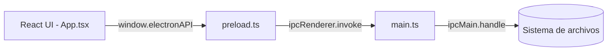

# Renombrar Archivos - Desktop App

Aplicación de escritorio multiplataforma para renombrar archivos en lote dentro de una carpeta local. Permite buscar y reemplazar texto en los nombres, reemplazar prefijos/sufijos (incluidas las variantes "hasta final"), agregar prefijos/sufijos y seleccionar de forma individual qué archivos renombrar, todo desde una interfaz gráfica moderna, sin necesidad de un backend ni conexión a internet.

## Índice
- [Descripción del proyecto](#descripción-del-proyecto)
- [Funcionalidades](#funcionalidades)
- [Stack tecnológico](#stack-tecnológico)
- [Arquitectura](#arquitectura)
- [Requisitos](#requisitos)
- [Instalación](#instalación)
- [Uso](#uso)
- [Scripts disponibles](#scripts-disponibles)
- [Estructura del proyecto](#estructura-del-proyecto)
- [Configuración avanzada](#configuración-avanzada)
- [Notas y advertencias](#notas-y-advertencias)
- [Licencia](#licencia)

## Descripción del proyecto

Este proyecto es una prueba de concepto (PoC) de una app de escritorio construida con **Electron** que renderiza su interfaz con **React** y **TypeScript**. Su objetivo es facilitar el renombrado masivo de archivos de una carpeta del sistema de archivos local: el usuario selecciona un directorio, la app lista sus archivos y permite aplicar reglas de búsqueda/reemplazo, reemplazo de prefijo/sufijo (estándar o truncando hasta el final del nombre) y adición de prefijo/sufijo sobre los nombres seleccionados, siempre sin considerar la extensión del archivo.

La comunicación entre la interfaz (proceso de renderer) y el sistema de archivos (proceso principal de Electron) se realiza de forma segura mediante `contextBridge` e `ipcMain`/`ipcRenderer`, sin exponer Node.js directamente al renderer (`contextIsolation: true`, `nodeIntegration: false`).

## Funcionalidades

- **Selección de directorio**: abre un diálogo nativo del sistema operativo para elegir la carpeta a procesar.
- **Listado de archivos**: muestra todos los archivos (no directorios) contenidos en la carpeta seleccionada.
- **Selección individual o total**: casillas de verificación para marcar/desmarcar archivos individuales y un checkbox de cabecera para seleccionar/deseleccionar todos.
- **Buscar y reemplazar**: sustituye una subcadena de texto por otra en los nombres de archivo.
- **Prefijo - Reemplazar por**: reemplaza el texto inicial del nombre (sin extensión) por otro.
- **Sufijo - Reemplazar por**: reemplaza el texto final del nombre (antes de la extensión) por otro.
- **Prefijo hasta final - reemplazar por**: trunca el nombre desde la primera aparición del texto buscado hasta el final, conservando lo anterior y agregando el reemplazo.
- **Sufijo hasta final - Reemplazar por**: igual que el anterior, pero toma la última aparición del texto buscado dentro del nombre.
- **Prefijo y sufijo (agregar)**: inserta texto al inicio del nombre o justo antes de la extensión.
- **Sin considerar la extensión**: todas las operaciones se aplican sobre el nombre base y respetan la extensión original del archivo.
- **Vista previa en vivo**: cada archivo muestra el nombre actual y el resultado con las reglas aplicadas, junto con el total de archivos que se renombrarán.
- **Renombrado en lote**: aplica todas las reglas a los archivos seleccionados de una sola vez, evitando colisiones de nombre (agrega un sufijo numérico si es necesario). Al finalizar muestra un aviso con el total de archivos renombrados.
- **Indicador de carga (spinner)**: feedback visual durante operaciones con latencia (listar/renombrar).
- **Interfaz moderna y responsiva**: tarjetas redondeadas, badges de color, controles con foco resaltado y notificaciones tipo toast; sin barra de menú, enfocada solo en la funcionalidad principal.

## Stack tecnológico

| Categoría          | Tecnología                          |
|---------------------|--------------------------------------|
| Framework de escritorio | [Electron](https://www.electronjs.org/) v29 |
| UI / Frontend       | [React](https://react.dev/) v18 + JSX/TSX |
| Lenguaje            | [TypeScript](https://www.typescriptlang.org/) v5 |
| Bundler             | [Webpack](https://webpack.js.org/) v5 (`webpack-cli`, `webpack-dev-server`, `html-webpack-plugin`, `ts-loader`) |
| Linter / Formato    | [ESLint](https://eslint.org/) v8 + `@typescript-eslint` + [Prettier](https://prettier.io/) |
| Orquestación dev    | [concurrently](https://www.npmjs.com/package/concurrently) + [wait-on](https://www.npmjs.com/package/wait-on) |
| Comunicación IPC    | `contextBridge`, `ipcMain`, `ipcRenderer` (Electron) |
| Sistema de archivos | Módulos nativos de Node.js `fs` y `path` |

## Arquitectura

La aplicación se divide en dos procesos, típico de Electron:

- **Proceso principal** ([src/main.ts](src/main.ts)): crea la ventana de `BrowserWindow`, gestiona el diálogo de selección de carpeta, lee el contenido del directorio y ejecuta el renombrado real de archivos en disco (`fs.renameSync`).
- **Script de preload** ([src/preload.ts](src/preload.ts)): expone de forma controlada las funciones `selectDirectory`, `listFiles` y `renameFiles` al renderer mediante `contextBridge.exposeInMainWorld('electronAPI', ...)`.
- **Proceso de renderer** ([src/App.tsx](src/App.tsx), [src/index.tsx](src/index.tsx)): interfaz React que consume `window.electronAPI` (a través de [src/fileUtils.ts](src/fileUtils.ts)) para listar y renombrar archivos, manteniendo el estado de la UI (directorio, archivos, selección, filtros).
- **Tipos compartidos** ([src/types.ts](src/types.ts)): define `RenameArgs`, el contrato de datos entre renderer y proceso principal vía IPC.



## Requisitos

- Node.js >= 18
- npm >= 9
- (Linux) netcat (`nc`), usado por el script de arranque

## Instalación

1. Clona el repositorio o copia los archivos en tu equipo.
2. Instala las dependencias:
   ```sh
   npm install
   ```

## Uso

### Windows
```bat
start-windows.bat
```

### Linux
```sh
chmod +x start-linux.sh
./start-linux.sh
```

Ambos scripts detectan si es necesario compilar el frontend (modo producción) y abren la aplicación de escritorio Electron automáticamente. Si ya existe el build (`dist/`), la app arranca instantáneamente; si no, primero compila y luego abre la app.

### Modo desarrollo

Para trabajar con recarga en caliente del frontend junto con Electron:
```sh
npm run dev
```
Esto levanta `webpack-dev-server` en `http://localhost:39417` y, una vez disponible, lanza Electron apuntando a ese servidor.

## Scripts disponibles

| Script                  | Descripción                                                                 |
|--------------------------|------------------------------------------------------------------------------|
| `npm run dev`            | Ejecuta en paralelo el servidor de desarrollo de React y Electron.          |
| `npm run electron-dev`   | Espera a que el dev server esté disponible y abre Electron.                 |
| `npm run react-start`    | Levanta `webpack serve` en modo desarrollo.                                  |
| `npm run build:renderer` | Compila el frontend (React) en modo producción con Webpack.                 |
| `npm run build:main`     | Compila `main.ts` y `preload.ts` a JavaScript (CommonJS) en `dist/main`.     |
| `npm run build`          | Ejecuta `build:renderer` y `build:main` (build completo de producción).     |
| `npm run electron`       | Lanza Electron usando el build existente.                                    |
| `npm run lint`           | Ejecuta ESLint con auto-fix sobre los archivos `.ts`/`.tsx` de `src/`.       |

## Estructura del proyecto

```
package.json          # Dependencias y scripts npm
webpack.config.js      # Configuración de Webpack (dev y producción)
tsconfig.json          # Configuración de TypeScript
start-windows.bat       # Script de arranque para Windows
start-linux.sh          # Script de arranque para Linux
public/
  index.html            # Plantilla HTML base para el renderer
src/
  main.ts               # Proceso principal de Electron (ventana, IPC, fs)
  preload.ts             # Puente seguro entre main y renderer (contextBridge)
  App.tsx                # Componente principal de la interfaz React
  index.tsx              # Punto de entrada del renderer (ReactDOM)
  fileUtils.ts            # Wrappers tipados sobre window.electronAPI
  types.ts                # Tipos compartidos (RenameArgs)
```

## Configuración avanzada

- El puerto usado por defecto por el dev server es `39417`. Puedes cambiarlo editando `webpack.config.js` y los scripts (`electron-dev`, `start-*.bat/sh`) que dependen de ese valor.
- La compilación del proceso principal (`build:main`) usa `tsc` directamente con `--module commonjs` y `--target ES2021`, separado de la compilación del renderer (que usa Webpack con `ts-loader`).

## Notas y advertencias

- No requiere servidor backend: toda la lógica corre localmente en el equipo del usuario.
- No hay barra de menú; toda la funcionalidad está disponible en la ventana principal.
- **Los cambios de nombre son irreversibles.** Usa la aplicación con precaución, especialmente al aplicar búsqueda/reemplazo sobre carpetas con archivos importantes.
- Si dos archivos terminan con el mismo nombre resultante, la app agrega automáticamente un sufijo numérico (`archivo (2).jpg`) para evitar sobreescribir archivos existentes.

## Licencia

MIT
